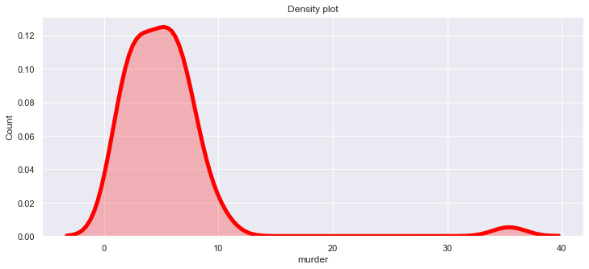

# Data_Visualization_Techniques
# Summary:
Data visualization is the pictorial representation of the data. It helps us to understand the data structure and relationships between them. Several methods can be used to visualize the data, such as simple text, tables, heatmap, and graphs. However, I have implemented many methods that are listed below.

1) Bar chart
2) Stacked bar chart
3) Histohram                                            
4) Pie chart
5) Donut chart
6) Scatter plot
7) Line chart
8) Stacked line chart
9) Heatmap
10) Contour map
11) Box plot
12) Bubble chart
13) Density plot
14) Tree map
15) Area chart
16) Stacked area chart
17) Step chart
18) Spatial chart

# Used Methods:
1) Python Programming language
2) R programming language
3) Tabelau

# Python and R Libraries:
1) Pandas
2) Numpy
3) Matplotlib
4) Seaborn
5) Plotly
6) GGplot

# Environment
1) Annaconda
2) R Studio
3) Jupyter Notebook

